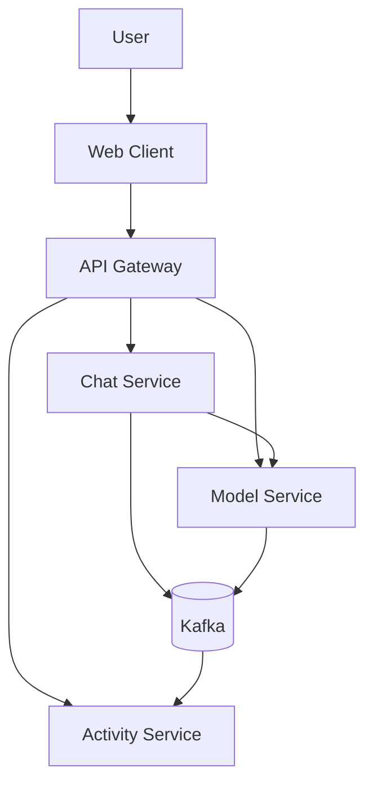
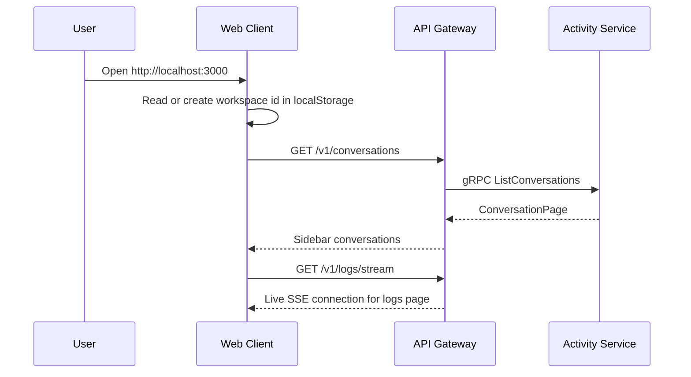
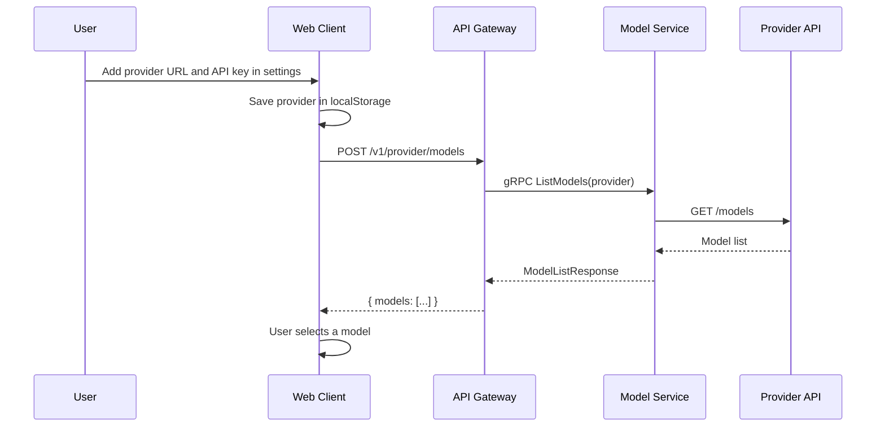
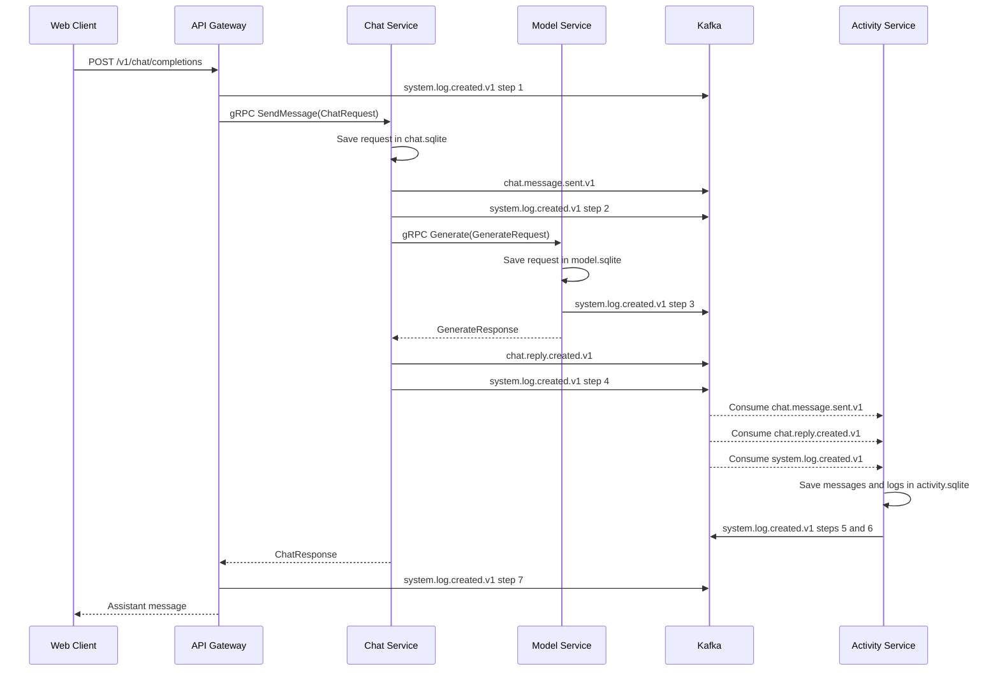
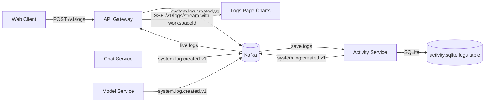
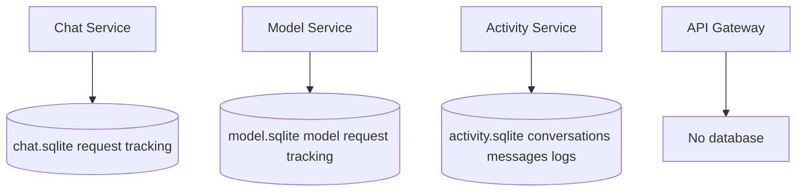
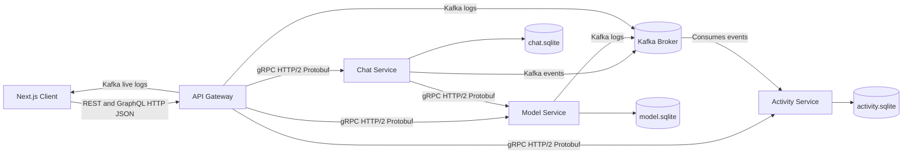
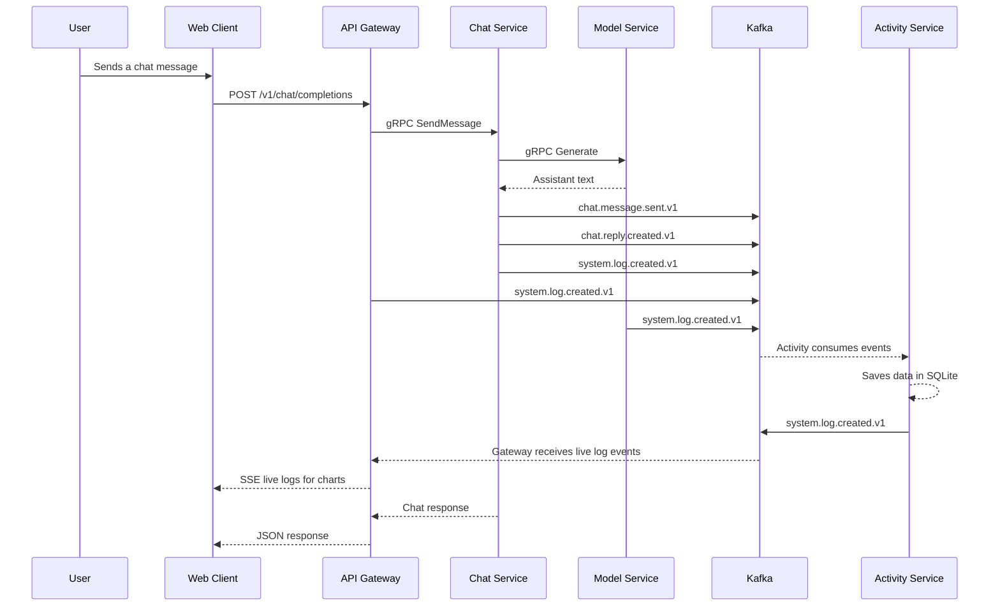

# AI Chatbot

A Node.js microservices project for a chat app. Real AI replies come from any OpenAI-compatible provider you configure. Conversations and logs are stored, and the activity logs show up live in the UI.

## System Overview

The web client only talks to the API Gateway. The Gateway calls the backend services over gRPC. Kafka carries messages and logs to the Activity Service.



| Part | What it does |
| --- | --- |
| Client | Web UI, sends HTTP requests to the Gateway |
| API Gateway | Public REST and GraphQL, gRPC clients to the services |
| Chat Service | Handles chat requests, asks Model Service for replies |
| Model Service | Calls the configured provider, lists models |
| Activity Service | Stores conversations, messages, and logs |
| Kafka | Async events between services |
| SQLite | One DB per stateful service |

## Website Workflow

The browser keeps a workspace id in localStorage and sends it as `x-luna-workspace-id` so each workspace is isolated.



## Provider And Models Workflow

The provider URL and API key are saved in the browser only, not in the backend.



## Send Message Workflow

Chat Service does not write history directly. It calls Model Service over gRPC, then publishes Kafka events that Activity Service consumes.



## Logs Page Workflow

Logs come from Kafka events plus UI actions. Events with the same correlation ID are grouped into one flow card in the UI.



| Chart | Meaning |
| --- | --- |
| Status | Success, warning, and error events |
| Services | Which service produced the most events |
| Latency | Recent processing time from log metadata |

The chat flow card uses these `system.log.created.v1` actions. All events share the same `correlationId`, so the UI can group them as one request.

| Step | Action | Producer | Meaning |
| --- | --- | --- | --- |
| 1 | `chat_request_01_gateway_received` | API Gateway | Gateway accepted the HTTP chat request |
| 2 | `chat_message_02_user_saved` | Chat Service | User prompt was saved and published to `chat.message.sent.v1` |
| 3 | `model_generate_03_provider_completed` | Model Service | Provider returned assistant text |
| 4 | `chat_reply_04_assistant_saved` | Chat Service | Assistant reply was published to `chat.reply.created.v1` |
| 5 | `activity_user_message_05_kafka_consumed` | Activity Service | Activity consumed and stored the user message |
| 6 | `activity_reply_06_kafka_consumed` | Activity Service | Activity consumed and stored the assistant reply |
| 7 | `chat_response_07_gateway_returned` | API Gateway | Gateway returned the HTTP response to the web client |
| 99 | `chat_error_99_failed` | Chat Service | Chat flow failed before completion |

## Data Ownership

Each stateful service owns its own SQLite file. The Gateway has no DB.



## Architecture



## Full Pipeline



## Components

| Component | Role | Protocols | Database |
| --- | --- | --- | --- |
| `frontend/web` | UI and logs charts | HTTP | Browser only |
| `backend/gateway` | Single entry point | REST, GraphQL, gRPC clients, Kafka | None |
| `chat-service` | Chat coordinator | gRPC server/client, Kafka producer | `chat.sqlite` |
| `model-service` | Provider bridge | gRPC server, Kafka producer | `model.sqlite` |
| `activity-service` | History and logs | gRPC server, Kafka consumers | `activity.sqlite` |
| `kafka` | Event broker | Kafka | Internal |

## REST Endpoints

Base URL: `http://localhost:8080`

| Method | Endpoint | Description |
| --- | --- | --- |
| `GET` | `/health` | Gateway health check |
| `GET` | `/v1/models` | Returns empty unless a provider is supplied |
| `POST` | `/v1/provider/models` | Fetch models from an OpenAI-compatible provider |
| `POST` | `/v1/chat/completions` | Send a chat message |
| `GET` | `/v1/conversations` | List conversations |
| `GET` | `/v1/conversations/:id/messages` | Messages of one conversation |
| `PATCH` | `/v1/conversations/:id` | Rename or pin |
| `DELETE` | `/v1/conversations/:id` | Delete |
| `GET` | `/v1/logs` | Stored logs |
| `GET` | `/v1/logs/stream` | Live SSE log stream |
| `POST` | `/v1/logs` | Record a UI action |
| `GET` | `/v1/analytics/usage` | Usage summary |
| `POST` | `/graphql` | GraphQL endpoint |

## Kafka Topics

| Topic | Producer | Consumer | Purpose |
| --- | --- | --- | --- |
| `chat.message.sent.v1` | Chat Service | Activity Service | Save user message |
| `chat.reply.created.v1` | Chat Service | Activity Service | Save assistant reply |
| `system.log.created.v1` | Gateway, Chat, Model, Activity | Activity, Gateway | Store and stream logs |

## Install And Run

Requires Node.js 22+, npm, and Docker for Kafka.

```bash
npm install
npm run docker:kafka
npm run dev
```

App: `http://localhost:3000`. Gateway health: `http://localhost:8080/health`.

## Docker

```bash
docker compose up --build
```

Starts Kafka, the gateway, all three services, and the frontend.

## Postman

Import:

| File | Purpose |
| --- | --- |
| `postman/soa-clean.postman_collection.json` | REST and GraphQL requests |
| `postman/soa-clean.postman_environment.json` | Local variables |

For gRPC, create a Postman gRPC request using `backend/proto/platform.proto`:

| Service | Method | Address |
| --- | --- | --- |
| `simplechat.v1.ModelService` | `ListModels` | `localhost:5103` |
| `simplechat.v1.ChatService` | `SendMessage` | `localhost:5102` |
| `simplechat.v1.ActivityService` | `ListLogs` | `localhost:5104` |
