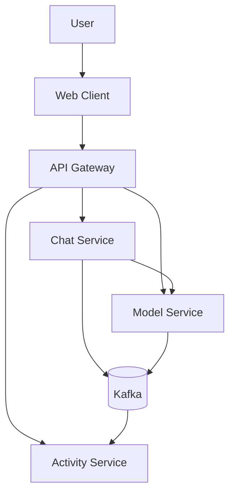
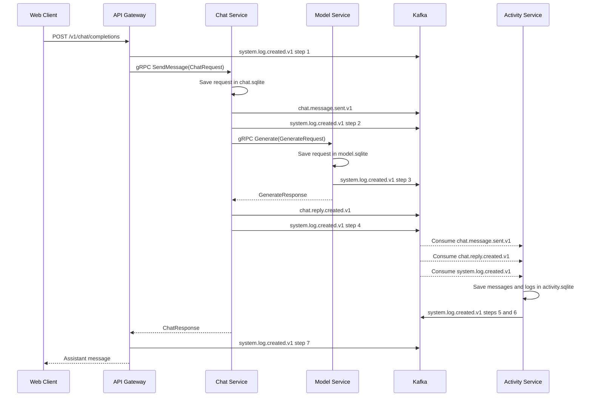
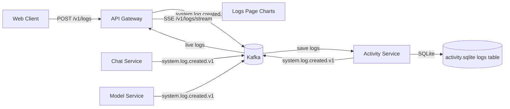
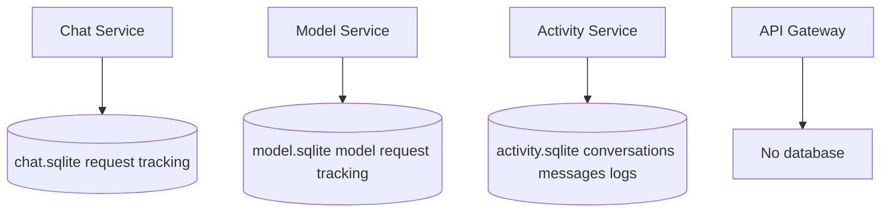

# Luna

<p align="center">
  
</p>

Luna is a Node.js microservices platform for a real-time AI chat experience. It supports any OpenAI-compatible provider, keeps conversation history, and streams structured activity logs into a live UI.

## What Luna Does

- Chat UI that only talks to a single API Gateway
- Provider-agnostic AI responses (OpenAI-compatible APIs)
- Kafka-backed events for chat history and logs
- Live logs page with grouped flows and metrics
- Local-first provider secrets (stored in browser only)

## System Overview

The web client talks only to the API Gateway. The gateway fans out to gRPC services, while Kafka carries events and logs to the Activity Service.



| Part | What it does |
| --- | --- |
| Client | Web UI and logs charts, calls the gateway |
| API Gateway | Public REST and GraphQL, gRPC clients to services |
| Chat Service | Handles chat requests, asks Model Service for replies |
| Model Service | Calls the configured provider, lists models |
| Activity Service | Stores conversations, messages, and logs |
| Kafka | Async events between services |
| SQLite | One DB per stateful service |

## Core Flows

### Chat Message Flow

Chat Service does not write history directly. It calls Model Service over gRPC, then publishes Kafka events that Activity Service consumes.



### Live Logs Flow

Logs come from Kafka events plus UI actions. Events with the same correlation ID are grouped into one flow card in the UI.



## Data Ownership

Each stateful service owns its own SQLite file. The Gateway has no DB.



## Components

| Component | Role | Protocols | Database |
| --- | --- | --- | --- |
| `frontend/web` | UI and logs charts | HTTP | Browser only |
| `backend/gateway` | Single entry point | REST, GraphQL, gRPC clients, Kafka | None |
| `chat-service` | Chat coordinator | gRPC server/client, Kafka producer | `chat.sqlite` |
| `model-service` | Provider bridge | gRPC server, Kafka producer | `model.sqlite` |
| `activity-service` | History and logs | gRPC server, Kafka consumers | `activity.sqlite` |
| `kafka` | Event broker | Kafka | Internal |

## REST Endpoints

Base URL: `http://localhost:8080`

| Method | Endpoint | Description |
| --- | --- | --- |
| `GET` | `/health` | Gateway health check |
| `GET` | `/v1/models` | Returns empty unless a provider is supplied |
| `POST` | `/v1/provider/models` | Fetch models from an OpenAI-compatible provider |
| `POST` | `/v1/chat/completions` | Send a chat message |
| `GET` | `/v1/conversations` | List conversations |
| `GET` | `/v1/conversations/:id/messages` | Messages of one conversation |
| `PATCH` | `/v1/conversations/:id` | Rename or pin |
| `DELETE` | `/v1/conversations/:id` | Delete |
| `GET` | `/v1/logs` | Stored logs |
| `GET` | `/v1/logs/stream` | Live SSE log stream |
| `POST` | `/v1/logs` | Record a UI action |
| `GET` | `/v1/analytics/usage` | Usage summary |
| `POST` | `/graphql` | GraphQL endpoint |

## Kafka Topics

| Topic | Producer | Consumer | Purpose |
| --- | --- | --- | --- |
| `chat.message.sent.v1` | Chat Service | Activity Service | Save user message |
| `chat.reply.created.v1` | Chat Service | Activity Service | Save assistant reply |
| `system.log.created.v1` | Gateway, Chat, Model, Activity | Activity, Gateway | Store and stream logs |

## Install And Run

Requires Node.js 22+, npm, and Docker for Kafka.

```bash
npm install
npm run docker:kafka
npm run dev
```

App: `http://localhost:3000`. Gateway health: `http://localhost:8080/health`.

## Docker

```bash
docker compose up --build
```

Starts Kafka, the gateway, all three services, and the frontend.

## Postman

Import:

| File | Purpose |
| --- | --- |
| `postman/soa-clean.postman_collection.json` | REST and GraphQL requests |
| `postman/soa-clean.postman_environment.json` | Local variables |

For gRPC, create a Postman gRPC request using `backend/proto/platform.proto`:

| Service | Method | Address |
| --- | --- | --- |
| `simplechat.v1.ModelService` | `ListModels` | `localhost:5103` |
| `simplechat.v1.ChatService` | `SendMessage` | `localhost:5102` |
| `simplechat.v1.ActivityService` | `ListLogs` | `localhost:5104` |
