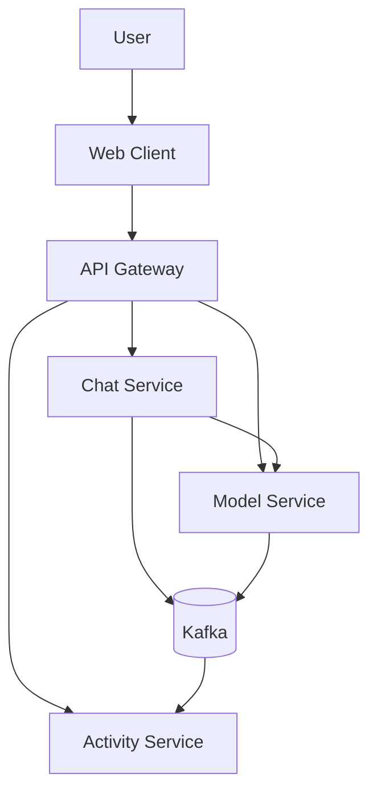
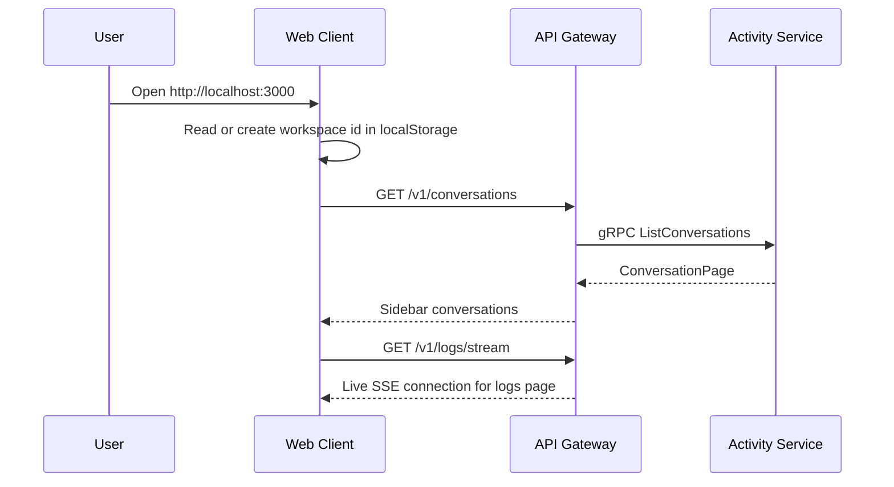
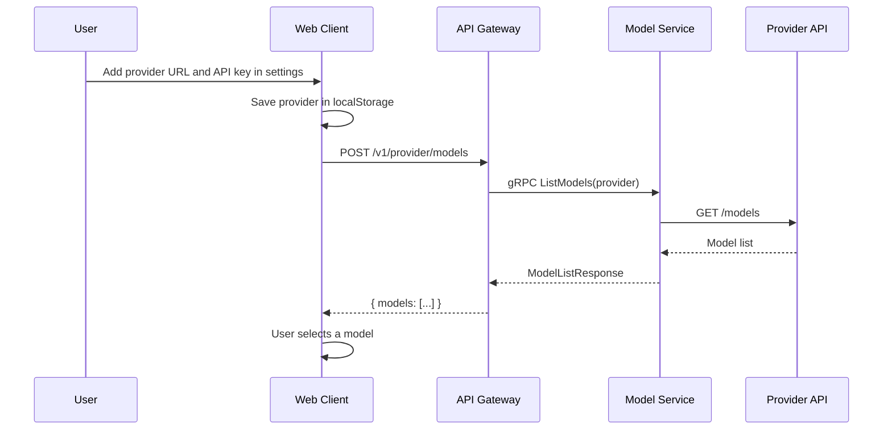
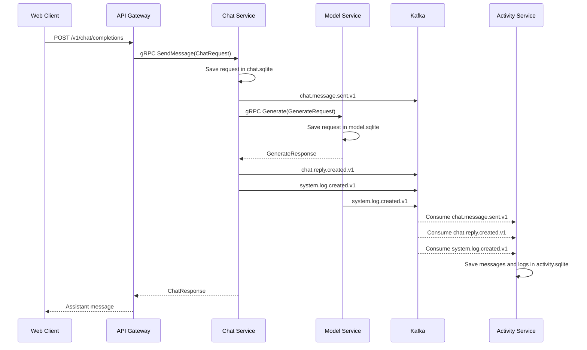

# AI Chatbot

A Node.js microservices project for a chat app. Real AI replies come from any OpenAI-compatible provider you configure. Conversations and logs are stored, and the activity logs show up live in the UI.

## System Overview

The web client only talks to the API Gateway. The Gateway calls the backend services over gRPC. Kafka carries messages and logs to the Activity Service.



| Part | What it does |
| --- | --- |
| Client | Web UI, sends HTTP requests to the Gateway |
| API Gateway | Public REST and GraphQL, gRPC clients to the services |
| Chat Service | Handles chat requests, asks Model Service for replies |
| Model Service | Calls the configured provider, lists models |
| Activity Service | Stores conversations, messages, and logs |
| Kafka | Async events between services |
| SQLite | One DB per stateful service |

## Website Workflow

The browser keeps a workspace id in localStorage and sends it as `x-luna-workspace-id` so each workspace is isolated.



## Provider And Models Workflow

The provider URL and API key are saved in the browser only, not in the backend.



## Send Message Workflow

Chat Service does not write history directly. It calls Model Service over gRPC, then publishes Kafka events that Activity Service consumes.



## Logs Page Workflow

Logs come from Kafka events plus UI actions. Events with the same correlation ID are grouped into one flow card in the UI.

```mermaid
flowchart LR
  Gateway[API Gateway] -->|system.log.created.v1| Kafka[(Kafka)]
  Chat[Chat Service] -->|system.log.created.v1| Kafka
  Model[Model Service] -->|system.log.created.v1| Kafka
  Client[Web Client] -->|POST /v1/logs| Gateway
  Gateway -->|gRPC RecordLog| Activity
  Kafka -->|save logs| Activity[Activity Service]
  Kafka -->|live logs| Gateway
  Gateway -->|SSE /v1/logs/stream (workspaceId)| LogsPage[Logs Page Charts]
  Activity -->|SQLite| LogsDb[(activity.sqlite logs table)]
```

| Chart | Meaning |
| --- | --- |
| Status | Success, warning, and error events |
| Services | Which service produced the most events |
| Latency | Recent processing time from log metadata |

## Data Ownership
