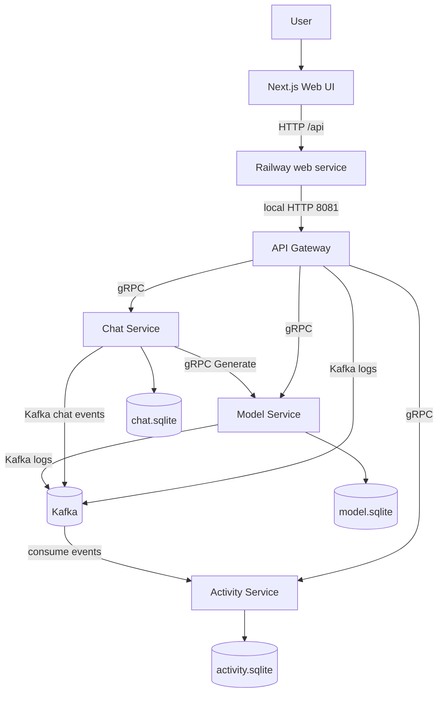
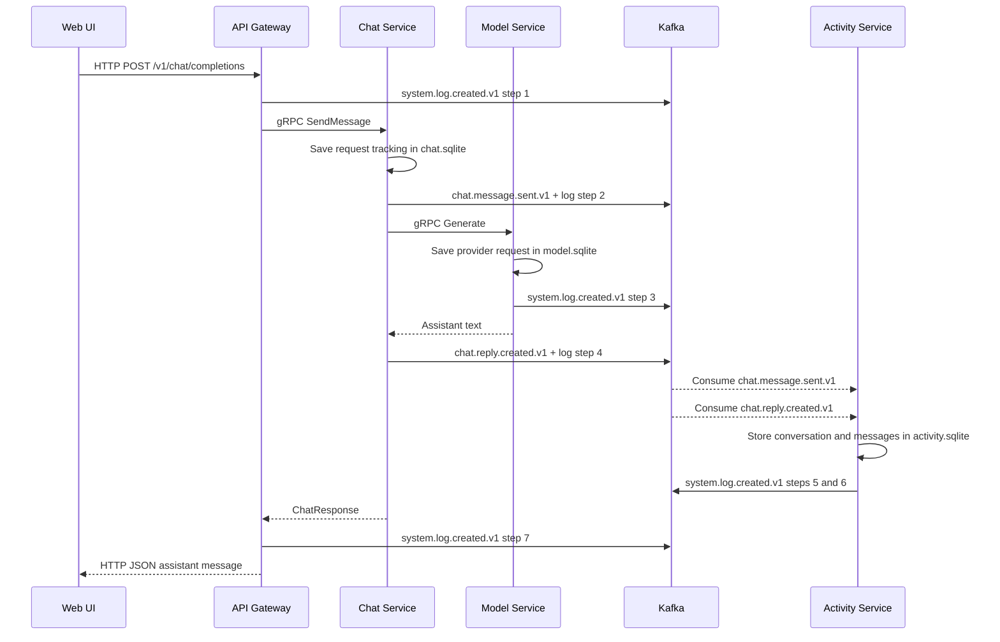
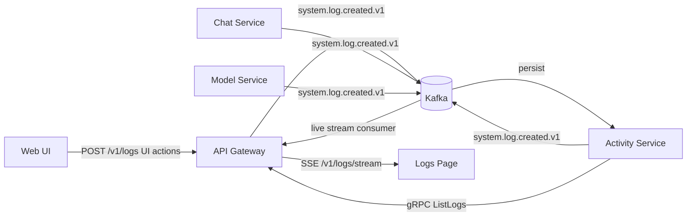

<p align="center">
  
</p>

<h1 align="center">Luna</h1>

<p align="center">
  A real-time AI chat platform built with Next.js, Node.js microservices, gRPC, Kafka, GraphQL, REST, and SQLite.
</p>

## Overview

Luna is an AI chat application designed as a service-oriented architecture. The browser talks to one public web service, while backend responsibilities are split into focused services for chat orchestration, model/provider access, conversation history, and audit logging.

The app supports OpenAI-compatible providers. Provider URLs and API keys stay in the browser, while conversations and system activity are persisted by backend services.

## Features

| Feature | Description |
| --- | --- |
| AI chat | Sends full chat turns to an OpenAI-compatible provider through the Model Service |
| Conversation history | Stores conversations and messages in Activity Service SQLite |
| Live activity logs | Streams Kafka-backed audit events to the logs page with SSE |
| Flow grouping | Groups logs by correlation ID so one chat message becomes one readable service flow |
| Provider settings | Stores provider URL, key, and selected model locally in the browser |
| REST and GraphQL | Exposes public REST endpoints plus a GraphQL endpoint from the API Gateway |
| Railway deployment | Runs within a 5-service Railway plan by combining web and gateway |

## Architecture

The web client never talks directly to the internal services. It calls `/api/*` on the web service, which proxies to the API Gateway running in the same container on Railway. The gateway then calls internal services over gRPC and publishes audit logs to Kafka.



## Services

| Service | Path | Protocols | Owns data | Responsibility |
| --- | --- | --- | --- | --- |
| Web | `frontend/web` | HTTP, SSE | Browser storage | Chat UI, settings, logs charts, `/api` proxy route |
| API Gateway | `backend/gateway` | REST, GraphQL, gRPC clients, Kafka producer/consumer | None | Public API, routing, live log stream |
| Chat Service | `backend/services/chat-service` | gRPC server/client, Kafka producer | `chat.sqlite` | Coordinates user prompts and assistant replies |
| Model Service | `backend/services/model-service` | gRPC server, HTTP provider calls, Kafka producer | `model.sqlite` | Lists models and calls OpenAI-compatible providers |
| Activity Service | `backend/services/activity-service` | gRPC server, Kafka consumers/producer | `activity.sqlite` | Stores conversations, messages, logs, and analytics |
| Kafka | Railway image service | Kafka | Broker state | Event broker for messages and logs |

## Chat Flow

One chat request crosses HTTP, gRPC, Kafka, and SQLite. Every important step emits `system.log.created.v1` with the same `correlationId`, which is why the logs page can show a single grouped flow.



## Activity Logs

The logs page combines stored history and live events. Stored logs come from Activity Service through gRPC. Live logs come from Kafka through the API Gateway SSE endpoint.



| Log step | Protocol | Meaning |
| --- | --- | --- |
| Gateway received the message | HTTP POST | Browser submitted a chat request |
| Chat Service saved the user prompt | gRPC + Kafka | Gateway called Chat Service and the user message event was published |
| Model Service got the provider reply | gRPC + Provider HTTP | Chat Service called Model Service, then Model Service called the provider |
| Chat Service saved the assistant reply | Kafka | Assistant reply event was published |
| Activity Service stored messages | Kafka -> SQLite | Activity Service consumed events and persisted history |
| Gateway returned the response | HTTP JSON | Browser received the assistant response |

## Data Ownership

Each stateful service owns its own SQLite database. Services do not share database files.

| Data | Owner | Storage |
| --- | --- | --- |
| Chat request tracking | Chat Service | `chat.sqlite` |
| Provider/model request tracking | Model Service | `model.sqlite` |
| Conversations | Activity Service | `activity.sqlite` |
| Messages | Activity Service | `activity.sqlite` |
| Audit logs | Activity Service | `activity.sqlite` |
| Provider API keys | Browser only | localStorage |

## API Surface

Local gateway base URL: `http://localhost:8080`.

Railway public API path: `https://web-production-3f2f4.up.railway.app/api`.

| Method | Endpoint | Purpose |
| --- | --- | --- |
| `GET` | `/health` | Gateway health check |
| `POST` | `/v1/provider/models` | Fetch provider models |
| `POST` | `/v1/chat/completions` | Send chat request |
| `GET` | `/v1/conversations` | List conversations |
| `GET` | `/v1/conversations/:id/messages` | List messages for one conversation |
| `PATCH` | `/v1/conversations/:id` | Rename or pin a conversation |
| `DELETE` | `/v1/conversations/:id` | Delete a conversation |
| `GET` | `/v1/logs` | Fetch stored logs |
| `GET` | `/v1/logs/stream` | Live SSE log stream |
| `POST` | `/v1/logs` | Record UI action |
| `GET` | `/v1/analytics/usage` | Usage summary |
| `POST` | `/graphql` | GraphQL endpoint |

## Kafka Topics

| Topic | Producer | Consumer | Purpose |
| --- | --- | --- | --- |
| `chat.message.sent.v1` | Chat Service | Activity Service | Persist user messages |
| `chat.reply.created.v1` | Chat Service | Activity Service | Persist assistant replies |
| `system.log.created.v1` | Gateway, Chat, Model, Activity | Activity Service, API Gateway | Store and stream audit logs |

## Local Development

Requirements: Node.js 22+, npm, and Docker.

```bash
npm install
npm run docker:kafka
npm run dev
```

Local URLs:

| App | URL |
| --- | --- |
| Web UI | `http://localhost:3000` |
| Gateway health | `http://localhost:8080/health` |
| Chat gRPC | `localhost:5102` |
| Model gRPC | `localhost:5103` |
| Activity gRPC | `localhost:5104` |

## Docker

```bash
docker compose up --build
```

This starts Kafka, the gateway, the three backend services, and the frontend.

## Railway Deployment

The Railway deployment uses five services:

| Railway service | Source | Important setting |
| --- | --- | --- |
| `kafka` | Docker image `apache/kafka:4.2.0` | Do not connect this service to the GitHub repo |
| `model-service` | GitHub repo `Luna-SOA/Luna` | `SERVICE_NAME=model-service` |
| `activity-service` | GitHub repo `Luna-SOA/Luna` | `SERVICE_NAME=activity-service` |
| `chat-service` | GitHub repo `Luna-SOA/Luna` | `SERVICE_NAME=chat-service` |
| `web` | GitHub repo `Luna-SOA/Luna` | `SERVICE_NAME=web-gateway` |

The `web` service runs both Next.js and the API Gateway to stay within the 5-service Railway limit:

| Variable | Value |
| --- | --- |
| `SERVICE_NAME` | `web-gateway` |
| `HOSTNAME` | `0.0.0.0` |
| `API_GATEWAY_PORT` | `8081` |
| `API_PROXY_TARGET` | `http://127.0.0.1:8081` |
| `NEXT_PUBLIC_API_BASE_URL` | `/api` |

Kafka should remain an image-based service. If Kafka is connected to the repo, it will try to run `railway-start.sh` with `SERVICE_NAME=kafka` and fail.

## Railway Power Switch

Use this before and after demos to reduce Railway RAM usage and avoid paying for idle services.

```powershell
npm run railway:status
npm run railway:pause
npm run railway:resume
```

What it does:

| Command | Effect |
| --- | --- |
| `npm run railway:status` | Shows current Railway service states |
| `npm run railway:pause` | Stops `web`, app services, then Kafka |
| `npm run railway:resume` | Starts Kafka first, then model, activity, chat, and web |

The script requires Railway CLI login or `RAILWAY_TOKEN`:

```powershell
railway login
```

Do not pause during a live demo. When paused, the public website is unavailable until `npm run railway:resume` completes.

## Verification

Run these before pushing or deploying:

```bash
npm run typecheck
npm run build:backend
npm run build:frontend
```

Production smoke checks:

```powershell
Invoke-WebRequest https://web-production-3f2f4.up.railway.app
Invoke-WebRequest https://web-production-3f2f4.up.railway.app/api/health
Invoke-WebRequest https://web-production-3f2f4.up.railway.app/api/v1/conversations
```

## Postman

Postman workspace created for submission:

```text
https://go.postman.co/workspace/22e3bdad-1779-4c8a-95cc-4ce0008eba21
```

It contains the REST, GraphQL, and gRPC test collection plus the hosted environment. If Postman shows the workspace as internal/team-only, open the workspace in Postman, go to `Overview` -> `Settings`, change `Workspace type` to `Public`, and save or submit the approval request.

Local files for import or backup:

| File | Purpose |
| --- | --- |
| `postman/soa-clean.postman_collection.json` | REST, GraphQL, and gRPC test guide with saved example responses |
| `postman/soa-clean.postman_environment.json` | Hosted Railway variables |
| `postman/README.md` | Postman import, run, publish, and gRPC setup guide |

For gRPC testing, create a Postman gRPC request using `backend/proto/platform.proto`.

| Service | Method | Address |
| --- | --- | --- |
| `simplechat.v1.ModelService` | `ListModels` | `localhost:5103` |
| `simplechat.v1.ChatService` | `SendMessage` | `localhost:5102` |
| `simplechat.v1.ActivityService` | `ListLogs` | `localhost:5104` |
